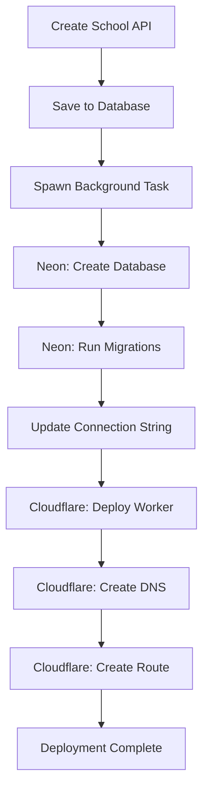

# Auto-Deployment System Guide

ระบบ deploy โรงเรียนอัตโนมัติเมื่อสร้างโรงเรียนใหม่ใน backend-admin

## 🎯 Features

เมื่อสร้างโรงเรียนใหม่จะทำอัตโนมัติ:
1. ✅ **Create Database** - สร้าง database ใน Neon (minimal setup)
2. ✅ **Setup Extensions** - UUID extension + migration table
3. ✅ **Deploy Workers** - Deploy Cloudflare Worker
4. ✅ **Setup DNS** - สร้าง DNS record
5. ✅ **Configure Routes** - เชื่อม subdomain กับ Worker

**Note:** Full schema migrations จัดการโดย backend-school เมื่อ start ครั้งแรก

---

## 📋 Prerequisites

### 1. Neon PostgreSQL

สมัครและสร้าง project:
1. ไปที่ https://neon.tech
2. สร้าง project
3. คัดลอก API key และ project ID

### 2. Cloudflare Account

1. สร้าง API token: https://dash.cloudflare.com/profile/api-tokens
   - Permissions: `Workers Scripts:Edit`, `DNS:Edit`, `Zone:Read`
2. คัดลอก Account ID จาก Workers dashboard
3. คัดลอก Zone ID จาก domain overview

---

## ⚙️ Configuration

### Backend .env

```bash
# Neon API (for database provisioning)
NEON_API_KEY=your_neon_api_key_here
NEON_PROJECT_ID=your_project_id_here
NEON_HOST=ep-xyz.us-east-2.aws.neon.tech
NEON_USER=neondb_owner
NEON_PASSWORD=your_neon_password

# Cloudflare API (for Workers deployment)
CLOUDFLARE_API_TOKEN=your_api_token_here
CLOUDFLARE_ACCOUNT_ID=your_account_id_here
CLOUDFLARE_ZONE_ID=your_zone_id_for_schoolorbit_app
```

---

## 🚀 Usage

### Create School (Auto-deploy)

```bash
curl -X POST http://localhost:8080/api/v1/schools \
  -H "Content-Type: application/json" \
  -b cookies.txt \
  -d '{
    "name": "โรงเรียนตัวอย่าง",
    "subdomain": "example-school",
    "adminNationalId": "1234567890123",
    "adminPassword": "password123"
  }'
```

**ผลลัพธ์:**
1. สร้าง school record ใน database
2. **Background task เริ่ม deploy:**
   ```
   🚀 Starting deployment for school: โรงเรียนตัวอย่าง
     📊 Creating database...
     🔧 Running migrations...
     💾 Updating school record...
     ☁️  Deploying Cloudflare Worker...
     🌐 Creating DNS record...
     🛣️  Creating Workers route...
   ✅ Deployment completed
      URL: https://example-school.schoolorbit.app
   ```

---

## 🔍 Monitoring

### Check Deployment Status

Backend logs จะแสดง progress:

```bash
# ถ้า deploy สำเร็จ
✅ Deployment completed for โรงเรียนตัวอย่าง
   URL: https://example-school.schoolorbit.app

# ถ้า deploy ล้มเหลว  
⚠️  Auto-deployment failed for โรงเรียนตัวอย่าง: Database creation failed
   You may need to deploy manually
```

### Check School Record

```bash
curl http://localhost:8080/api/v1/schools/{school-id} \
  -b cookies.txt
```

Response จะมี `db_connection_string` ถ้า deploy สำเร็จ:

```json
{
  "success": true,
  "data": {
    "id": "...",
    "name": "โรงเรียนตัวอย่าง",
    "subdomain": "example-school",
    "dbName": "schoolorbit_example-school",
    "dbConnectionString": "postgresql://...",
    "status": "active"
  }
}
```

---

## 🛠️ Architecture



---

## 📂 Database Schema (Auto-created)

แต่ละโรงเรียนจะมี database ที่มี tables:

### `students`
- id (UUID)
- name
- national_id_hash
- national_id_encrypted
- grade
- timestamps

### `teachers`
- id (UUID)
- name
- national_id_hash
- national_id_encrypted
- subject
- timestamps

### `classes`
- id (UUID)
- name
- grade
- section
- teacher_id (FK)
- timestamps

---

## 🔧 Manual Deployment (Fallback)

ถ้า auto-deployment ล้มเหลว:

### 1. Create Database Manually

```sql
-- In Neon console
CREATE DATABASE schoolorbit_example_school;
```

### 2. Deploy Worker Manually

```bash
# Build frontend-school
cd frontend-school
npm run build

# Deploy to Cloudflare
npx wrangler deploy --name school-example-school
```

### 3. Update School Record

```bash
curl -X PUT http://localhost:8080/api/v1/schools/{school-id} \
  -H "Content-Type: application/json" \
  -b cookies.txt \
  -d '{
    "dbConnectionString": "postgresql://..."
  }'
```

---

## ⚠️ Limitations & Notes

### Current Limitations:
1. **Worker Script**: ตอนนี้ deploy placeholder script
   - ต้องแก้เป็น built SvelteKit app ใน production
2. **Database Cleanup**: ต้องลบ manual เมื่อ delete school
3. **DNS Propagation**: อาจใช้เวลา 1-2 นาที

### Production TODO:
- [ ] Deploy real frontend-school template
- [ ] Add rollback mechanism
- [ ] Implement database cleanup on delete
- [ ] Add deployment status tracking
- [ ] Queue system for multiple deployments
- [ ] Deployment webhooks/notifications

---

## 🐛 Troubleshooting

### "NEON_API_KEY not set"
```bash
# Check .env file
cat backend-admin/.env | grep NEON
```

### "Cloudflare API error: 403"
- ตรวจสอบ API token permissions
- ต้องมี Workers Scripts:Edit, DNS:Edit

### "Database creation failed"
- ตรวจสอบ Neon project quota
- ตรวจสอบ network connectivity

### "DNS creation failed"
- Subdomain อาจมีอยู่แล้ว
- ตรวจสอบ Zone ID ถูกต้อง

---

## 📚 API Reference

### DeploymentService

```rust
// Create deployment service
let service = DeploymentService::new(pool)?;

// Deploy school
service.deploy_school(&school).await?;

// Undeploy (cleanup)
service.undeploy_school(&school).await?;
```

### CloudflareClient

```rust
let client = CloudflareClient::new()?;

// Deploy Worker
client.deploy_worker("school-name", &script).await?;

// Create DNS
client.create_dns_record(zone_id, subdomain).await?;

// Create route
client.create_route(zone_id, pattern, script_name).await?;
```

### NeonClient

```rust
let client = NeonClient::new()?;

// Create database
let conn_string = client.create_database("db_name").await?;

// Run migrations
client.run_migrations(&conn_string).await?;

// Delete database
client.delete_database("db_name").await?;
```

---

**🎉 Auto-deployment system ready for production!**
