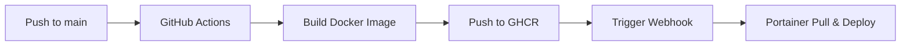

# Backend Admin - Auto Deploy Setup Guide

## 📋 Prerequisites

1. **GitHub Repository**
   - Push code to GitHub
   - Enable GitHub Actions

2. **Portainer Setup**
   - Portainer instance running
   - Stack created for backend-admin
   - Webhook URL generated

3. **Docker Network**
   - Create external network: `docker network create schoolorbit-network`

4. **GitHub Container Registry**
   - Public or private repository access configured

---

## 🚀 Setup Instructions

### Step 1: Configure GitHub Secrets

ไปที่ `Settings` → `Secrets and variables` → `Actions` → `New repository secret`

เพิ่ม secret:
- **Name**: `PORTAINER_WEBHOOK_URL`
- **Value**: `https://your-portainer-domain/api/webhooks/your-webhook-token`

### Step 2: Create Portainer Stack

1. เข้า Portainer Web UI
2. ไปที่ `Stacks` → `Add stack`
3. ตั้งชื่อ: `schoolorbit-backend-admin`
4. เลือก `Web editor`
5. Copy content จาก `docker-compose.portainer.yml`
6. กด `Deploy the stack`

### Step 3: Configure Stack Environment Variables

ใน Portainer stack settings, เพิ่ม Environment variables:

```env
DATABASE_URL=postgresql://...
JWT_SECRET=your-secret-key
ALLOWED_ORIGINS=https://admin.schoolorbit.app
GITHUB_REPOSITORY_OWNER=your-github-username
```

### Step 4: Enable Webhook

1. ใน Stack settings, เปิด `Enable webhook`
2. Copy webhook URL
3. เพิ่มใน GitHub Secrets (ตาม Step 1)

### Step 5: Create External Network

```bash
docker network create schoolorbit-network
```

---

## 🔄 Deployment Flow



1. **Developer pushes code** to `main` branch
2. **GitHub Actions** triggers automatically
3. **Build** Docker image (multi-stage build)
4. **Push** image to GitHub Container Registry
5. **Webhook** triggers Portainer deployment
6. **Portainer** pulls new image and redeploys

---

## 🧪 Testing Deployment

### Manual Trigger
ไปที่ GitHub → `Actions` → `Deploy Backend Admin to Portainer` → `Run workflow`

### Check Logs
```bash
# In Portainer
Containers → schoolorbit-backend-admin → Logs

# Or via Docker CLI
docker logs schoolorbit-backend-admin -f
```

### Verify Health
```bash
curl https://your-domain/health
```

---

## 📝 Webhook URL Format

Portainer webhook URL format:
```
https://<portainer-domain>/api/webhooks/<webhook-id>
```

Example:
```
https://portainer.example.com/api/webhooks/01c91c9e-xxxx-xxxx-xxxx-xxxxxxxxxxxx
```

---

## 🔒 Security Notes

1. **Never commit** `.env` files
2. **Use GitHub Secrets** for sensitive data
3. **Enable HTTPS** for webhook URL
4. **Rotate secrets** periodically
5. **Use strong** JWT_SECRET (min 32 characters)

---

## 🐛 Troubleshooting

### Build fails
- Check Rust dependencies in `Cargo.toml`
- Ensure `sqlx` migrations exist

### Deploy fails
- Verify webhook URL in GitHub Secrets
- Check Portainer webhook is enabled
- Ensure network `schoolorbit-network` exists

### Container crashes
- Check environment variables
- Verify DATABASE_URL connection
- Check container logs in Portainer

---

## 📊 Monitoring

### Health Check Endpoint
```bash
GET /health
```

Response:
```json
{
  "status": "healthy",
  "timestamp": "2025-01-05T10:00:00Z"
}
```

### Portainer Health Status
Stack → Containers → Health indicator

---

## 🔄 Manual Update

If webhook fails, manual update:

```bash
# Pull latest image
docker pull ghcr.io/your-username/schoolorbit-backend-admin:latest

# Restart stack in Portainer UI
# Or via Docker Compose
docker-compose -f docker-compose.portainer.yml up -d
```

---

## 📚 Additional Resources

- [Portainer Webhooks Documentation](https://docs.portainer.io/user/docker/stacks/webhooks)
- [GitHub Actions Documentation](https://docs.github.com/en/actions)
- [Docker Multi-stage Builds](https://docs.docker.com/build/building/multi-stage/)

---

## ✅ Checklist

- [ ] GitHub repository created
- [ ] GitHub Actions enabled
- [ ] `PORTAINER_WEBHOOK_URL` secret added
- [ ] Portainer stack created
- [ ] Environment variables configured
- [ ] External network created
- [ ] Webhook enabled in Portainer
- [ ] First deployment tested
- [ ] Health check verified

---

**Ready to deploy!** 🚀

Push to `main` branch and watch the magic happen!
