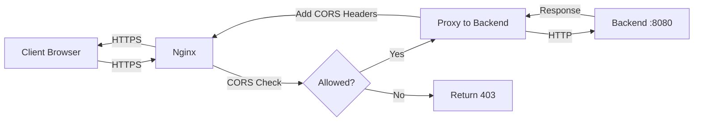

# Nginx Reverse Proxy Setup Guide

Backend ไม่ได้จัดการ CORS เอง แต่ใช้ **nginx reverse proxy** แทน เพื่อ:
- ✅ Centralized CORS management
- ✅ SSL/TLS termination
- ✅ Better performance
- ✅ Security headers

---

## 📋 Prerequisites

```bash
# Install nginx
sudo apt update
sudo apt install nginx

# Start nginx
sudo systemctl start nginx
sudo systemctl enable nginx
```

---

## 🔧 Configuration

### 1. Copy Config File

```bash
sudo cp backend-admin/nginx.conf.example /etc/nginx/sites-available/backend-admin
```

### 2. Edit Configuration

```bash
sudo nano /etc/nginx/sites-available/backend-admin
```

แก้ไข:
- `server_name api.schoolorbit.app` → domain ของคุณ
- SSL certificate paths
- Allowed origins (regex pattern)

### 3. Enable Site

```bash
# Create symlink
sudo ln -s /etc/nginx/sites-available/backend-admin /etc/nginx/sites-enabled/

# Test configuration
sudo nginx -t

# Reload nginx
sudo systemctl reload nginx
```

---

## 🔐 SSL Setup (Certbot)

```bash
# Install certbot
sudo apt install certbot python3-certbot-nginx

# Get SSL certificate
sudo certbot --nginx -d api.schoolorbit.app

# Auto-renewal is configured automatically
```

---

## 🎯 CORS Configuration

ใน `nginx.conf.example` มี CORS config ที่อนุญาต:

```nginx
# Allowed origins (regex)
if ($http_origin ~* (https://admin\.schoolorbit\.app|https://schoolorbit\.app|http://localhost:5173)) {
    set $cors_origin $http_origin;
}
```

**เพิ่ม origin ใหม่:**
1. แก้ regex pattern: `https://admin\.schoolorbit\.app|https://new-domain\.com`
2. Reload nginx: `sudo nginx -t && sudo systemctl reload nginx`

---

## 🧪 Testing

### 1. Test Backend Direct (without nginx)

```bash
curl http://localhost:8080/health
```

### 2. Test Through Nginx

```bash
curl https://api.schoolorbit.app/health
```

### 3. Test CORS Preflight

```bash
curl -X OPTIONS https://api.schoolorbit.app/api/v1/auth/login \
  -H "Origin: https://admin.schoolorbit.app" \
  -H "Access-Control-Request-Method: POST" \
  -v
```

ควรเห็น:
```
< HTTP/2 204
< access-control-allow-origin: https://admin.schoolorbit.app
< access-control-allow-credentials: true
```

---

## 📊 Monitoring

### Check Nginx Logs

```bash
# Access log
sudo tail -f /var/log/nginx/backend-admin.access.log

# Error log
sudo tail -f /var/log/nginx/backend-admin.error.log
```

### Check Backend Logs

```bash
# If running via Docker
docker logs schoolorbit-backend-admin -f

# If running directly
journalctl -u backend-admin -f
```

---

## 🔄 Deployment Workflow



1. Client request → Nginx (HTTPS)
2. Nginx checks CORS origin
3. If allowed → Proxy to backend (HTTP)
4. Backend response → Nginx
5. Nginx adds CORS headers
6. Response to client (HTTPS)

---

## 🛡️ Security Notes

### Headers Added by Nginx

```nginx
X-Frame-Options: SAMEORIGIN
X-Content-Type-Options: nosniff
X-XSS-Protection: 1; mode=block
```

### Backend Security

Backend ยังคงมี:
- ✅ JWT validation
- ✅ HttpOnly cookies
- ✅ Secure cookie flags
- ✅ Database encryption

Nginx เพิ่ม:
- ✅ HTTPS/TLS
- ✅ CORS validation
- ✅ Security headers
- ✅ Rate limiting (optional)

---

## 🚨 Troubleshooting

### CORS Error: "No 'Access-Control-Allow-Origin' header"

**ตรวจสอบ:**
1. Origin อยู่ใน allowed list หรือไม่
2. Nginx config ถูกต้องหรือไม่: `sudo nginx -t`
3. Nginx reload แล้วหรือยัง: `sudo systemctl reload nginx`

### 502 Bad Gateway

**สาเหตุ:**
- Backend ไม่ได้รัน
- Backend crash
- Port conflict

**แก้:**
```bash
# Check backend status
docker ps | grep backend-admin

# Check backend logs
docker logs schoolorbit-backend-admin

# Restart backend
docker restart schoolorbit-backend-admin
```

### SSL Certificate Error

**แก้:**
```bash
# Renew certificate
sudo certbot renew --dry-run

# Force renewal
sudo certbot renew --force-renewal
```

---

## 📚 Additional Resources

- [Nginx CORS Guide](https://enable-cors.org/server_nginx.html)
- [Certbot Documentation](https://certbot.eff.org/)
- [Nginx Security Headers](https://securityheaders.com/)

---

## ✅ Checklist

Deployment checklist:

- [ ] Nginx installed
- [ ] Config file copied and edited
- [ ] Domain DNS configured
- [ ] SSL certificate obtained
- [ ] Nginx config tested (`nginx -t`)
- [ ] Site enabled and nginx reloaded
- [ ] CORS tested from frontend
- [ ] Health check accessible
- [ ] Logs monitoring setup
- [ ] Auto-renewal configured

---

**🎉 Backend with Nginx reverse proxy ready for production!**
